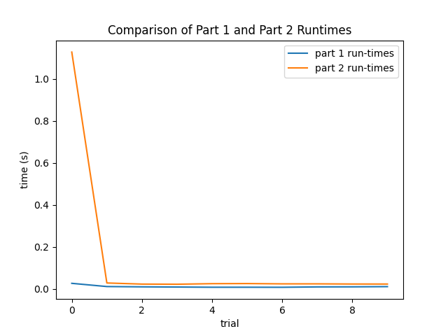

# Engineering Notebook
### By Rakesh Nori, Soham Bose, and Christy Jestin

This is the engineering notebook for the first design project in CS 262. Our assignment was to create a client server application for a chat server and to implement the chat server with both our own wire protocol and gRPC. The project was very open-ended with only a few core functionalities that the chat server needed to have.

## General Idea: UI and Overall Setup
Users interact with the server by running the client file in their terminal. They're given a series of options such as "Create Account", "Login", and "Send Message". Depending on the option selected, the user is then asked for relevant information such as a username or what message they'd like to send. The client then sends a request to the server. The server validates the request and either returns the requested information (e.g. "List All Accounts") or simply indicates whether the method call succeeded (e.g. "Login"). The client relays this info to the user by printing to the terminal, and the user is again presented with the list of options. Validation on the server side ensures that the method requested makes sense in context. For example, a client should only be able to create an account with a username that is not already in use.

There is no persistent data outside of the server's list of users and online users. Messages are deleted as they are sent to the intended recipients, and clients do not record any state except for the current user. Messages sent to offline users are temporarily queued until the user logs back in. This design decision was made for convenience and simplicity since we don't need to manage a database or encrypt personal data for storage. There is also no user authentication for similar reasons.

## Part 2: Implementing gRPC
We decided to implement Part 2 first since gRPC handles the key functionality of sending packets back and forth between the client and the server.

We buit the Chat service in the protobuf (found in `chat.proto`) to reflect the requirements of the design spec (send message, create account, login, logout, list accounts, delete account). The non-intuitive service is ChatStream, which as documented opens the stream relaying messages received by the server for a specific recipient to that individual. This is a non-user facing method, and we intend for it to be triggered when the user logs in. All of the messages reflect the arguments and return values we want to keep track of. Most responses simply need boolean flags for whether it was done successfuly, while the chat stream produces a stream of messages, and list accounts produced a list of strings corresponding to the matching accounts.

On the client side, our code parses user input, packages gRPC requests, and then uses the stub to send these requests to the server. On the server side, we handle requests by maintaining variables to track users, online users, and queued messages. For example, when a message is sent from user A to user B, the message is added to the queue for user B, and a separate thread sends the message to user B whenever they're online: this might be immediate because the user is logged in, or it might be in 5 days when they log back on. The set of users is maintained to ensure that usernames are unique and so that the users are able to find out who else is on the chat server.

One primary concern with these state variables is race conditions when there are multiple threads running on the server and they're trying to access the same resource. We avoided this issue by adding locks that guard the shared objects. A potential issue with locking is that one thread might take over a resource completely and indefinitely block all other threads that are waiting to access the same resource. For example, there are threads dedicated to sending messages to logged in users. These dispatcher threads are constantly checking the user's queue to ensure that there aren't any remaining messages that need to be sent out. However if they're constantly using the lock that guards the queue, then other threads would never be able to add messages to the queue: this would debilitate the server since the other threads would block and wait, and it would even prevent the dispatcher thread from doing its job because it never sees new messages. The solution is to have the dispatcher thread run a loop and regularly release the lock to allow other threads to access and modify the queue.

## Part 1: gRPC vs Sockets
After implementing part 2, we pivoted to re-implementing the chat server without gRPC. Our overarching approach was to change as little as possible and just implement the functionality handled by gRPC in part 2. To do this we setup sockets to send data back and forth between the client and server as well as an encoding scheme to represent the services we used in gRPC. For example, we have a common function that encodes and decodes all method calls. Method calls were transmitted as a tuple where the first element is an integer code for that method and the second element is a tuple of the arguments that should be passed to the method. This setup allows us to closely mimic services in gRPC with a client initiating a method by encoding the method call and sending this info &mdash; then waiting for the server to process the method and return an encoded output.

All data was encoded by casting objects to strings and then encoding the string with the utf-8 encoding scheme. On the other end, the data would be decoded with utf-8 and then passed as a string to the eval function (a built-in Python function that effectively undoes the conversion to strings).

While this approach made it easy to re-implement most methods, it was insufficient for our ChatStream. This is because the client can't just block until the server responds. The server never actually responds in the usual sense of returning an output: instead it intermittently yields messages whenever they're received from other users. In our gRPC implementation, a thread on the client listened for new chats being forwarded from the server. We adapted this thread to open a new socket dedicated to listening for new chats. This way the client can continue to use the main socket to send requests to the server. Note that the messages sent for part 1 are intended to be less than 1024 bytes.

## Comparison between Part 1 and Part 2
### Code Complexity
Our gRPC methods are harder to understand and implement because they follow the gRPC convention of taking request objects as inputs. This obscures the actual pieces of information being passed back and forth since they are simply specified in the protocol buffer files. We mitigated this issue by defining variables for commonly accessed request attributes at the beginning of the function e.g. `sender = request.sender`.

While the non-gRPC methods have almost identical implementations, they have clearer function headers that expose all arguments. At the same time, the non-gRPC code requires encoding and decoding of all data and a decent chunk of code to handle sockets and the initiating of method calls. This was abstracted in the gRPC implementation since we were extending the servicer object for the server and using the stub object in the client.

All in all, the two implementations are quite similar with a small (in terms of lines of code) but drastic difference with regards to the abstraction provided by gRPC. However, it might be the case that this is true only because we wrote the gRPC implementation first and tried to change just the gRPC functionality in the non-gRPC implementation i.e. our code structure in the non-gRPC implementation may have benefited heavily from mimicking how services and requests work in gRPC.

### Time Comparison

For the time-comparison, we simulated a sample session between client and server and montiored how fast it would take to complete the requests. Here's a graph comparing the two run-times over 10 trials:

### Buffer Size

## Testing
We implemented testing using `pytest` a package built for python unit testing. For both parts, we tested each core function as defined by the project spec as well as some edge cases where the server should report an error (e.g. creating an account that exists, sending a message to an account that does not exist, etc.). 